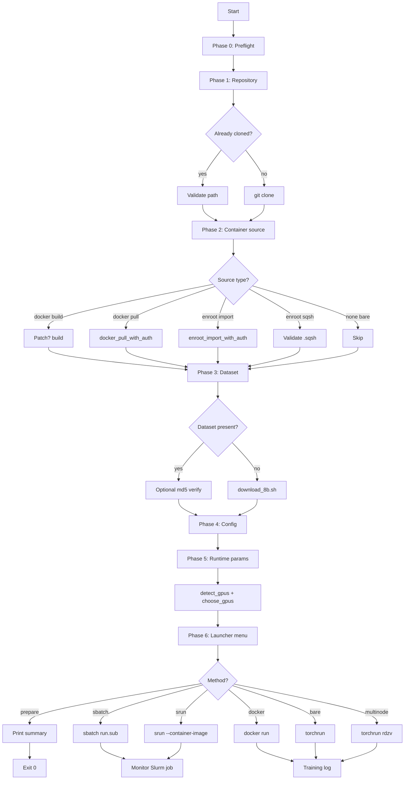

# MLPerf Training v5.1 — Interactive Runner

[](https://mlcommons.org/benchmarks/training/)
[](LICENSE)
[](#supported-platforms)

A single, self-contained, idempotent Bash driver that guides an operator through the full lifecycle of running any NVIDIA MLPerf Training v5.1 submission — from source checkout through container provisioning, dataset ingestion, configuration selection, and benchmark launch — across heterogeneous target environments (workstations, single-node Docker hosts, and multi-node Slurm clusters). Workloads are contributed as lightweight manifest files; the driver itself stays workload-agnostic.

## Supported Workloads

| Workload | Domain | Dataset | Impl Path |
|----------|--------|---------|-----------|
| `llama31_8b` | LLM pretrain | C4 (preprocessed) | `llama31_8b/implementations/nemo` |
| `llama31_405b` | LLM pretrain | C4 + Mixtral 8x22b tokenizer | `llama31_405b/implementations/theia_ngpu512_ngc25.09_nemo` |
| `llama2_70b_lora` | LLM fine-tune | GovReport | `llama2_70b_lora/implementations/nemo` |
| `flux1` | Text-to-image | CC12M + COCO (Energon) | `flux1/implementations/theia_ngpu16_ngc25.09_nemo` |
| `retinanet` | Object detection | OpenImages-v6 (MLPerf subset) | `retinanet/implementations/tyche_ngpu8_ngc25.04_pytorch` |
| `dlrm_dcnv2` | Recommendation | Criteo 1TB | `dlrm_dcnv2/implementations/hugectr` |
| `rgat` | Graph neural net | IGBH-Full | `rgat/implementations/tyche_ngpu8_ngc25.03_dgl` |

---

## Table of Contents

1. [Executive Summary](#1-executive-summary)
2. [Scope & Non-Goals](#2-scope--non-goals)
3. [Architecture](#3-architecture)
4. [Design Decisions](#4-design-decisions)
5. [Prerequisites](#5-prerequisites)
6. [Installation](#6-installation)
7. [Usage](#7-usage)
8. [Runtime Matrix](#8-runtime-matrix)
9. [Workflow](#9-workflow)
10. [Edge Cases Handled](#10-edge-cases-handled)
11. [Operator Toolkit (`tools/`)](#11-operator-toolkit-tools)
12. [Cluster Provisioning](#12-cluster-provisioning)
13. [Compliance Certification](#13-compliance-certification)
14. [Troubleshooting](#14-troubleshooting)
15. [Security Considerations](#15-security-considerations)
16. [Contributing](#16-contributing)
17. [License & Attribution](#17-license--attribution)

---

## 1. Executive Summary

Reproducing the NVIDIA MLPerf training submissions is an involved, error-prone exercise. A typical attempt, per workload, requires the operator to:

- Clone a large multi-vendor repository and navigate to a specific submission path.
- Build (or pull) a carefully-versioned CUDA/PyTorch container with customised Transformer Engine, Megatron-LM, NeMo, HugeCTR, DGL, or Apex source trees.
- Stage anywhere from 300 GB (Llama 2 70B LoRA) to 8 TB (DLRM Criteo 1TB) of preprocessed data under a rigid directory layout.
- Choose an appropriate topology configuration (nodes × GPUs × parallelism degrees) from a matrix of canonical `config_*.sh` files tailored to DGX B200, GB200, GB300, etc.
- Launch via a Slurm+Pyxis+Enroot submission script that assumes a very particular scheduler environment.

Every one of these steps has multiple common failure modes: wrong image architecture, truncated downloads, nested directories, path-translation quirks on Windows, registry authentication, and dozens of environment-variable contracts between configuration files and the training launcher.

This tool collapses that workflow into a single interactive driver (`mlperf.sh`) backed by per-workload manifests (`workloads/<name>.manifest.sh`). The driver (a) prompts for every consequential choice, (b) auto-detects and installs missing tooling where possible, (c) adapts its launch strategy to the detected environment (cluster vs. workstation, container vs. bare-metal), and (d) degrades gracefully when full MLPerf compliance is not achievable (e.g., on consumer-grade GPUs). Adding a new workload means dropping a ~50-line manifest file; the driver itself does not change. The driver is intentionally self-contained — a single ~900-line Bash file with zero runtime dependencies beyond standard POSIX utilities — so it can be audited, reviewed, and distributed as an artefact alongside the MLPerf submission.

---

## 2. Scope & Non-Goals

### In Scope
- Reproduction of any NVIDIA MLPerf Training v5.1 submission shipped under `NVIDIA/benchmarks/<workload>/implementations/` in `mlcommons/training_results_v5.1`, selected via a manifest picker at launch time.
- Four execution modalities: Docker (single node), Enroot/Pyxis (cluster), bare-metal Python (single or multi-node), and prepare-only (staging without launch).
- Assisted tooling installation on Debian/RHEL/Arch/SUSE/Alpine Linux; guided installation on macOS and Windows/WSL2.
- Interactive runtime configuration, GPU subset selection, and disk-space pre-flight checks.
- **Model weight conversion** (HF ↔ NeMo) for all LLM workloads — `tools/convert_weights.sh`.
- **Post-training evaluation** and MLPerf log parsing — `tools/eval.sh`.
- **Submission packaging** in MLCommons' `training_results_vX.Y/<submitter>/...` layout — `tools/submit.sh`.
- **Submission PR** to `mlcommons/training_results_vX.Y` via `gh` — `tools/submit_pr.sh`.
- **Cluster provisioning** — single-node (`tools/provision/bootstrap_node.sh`) and multi-node via an Ansible role (`tools/provision/ansible/`).
- **Fabric provisioning** — nvidia-fabricmanager, MLNX_OFED / DOCA-Host, RDMA sysctls, GPUDirect RDMA module — `tools/provision/fabric.sh`.
- **Shared filesystem client** — NFSv4, Lustre, BeeGFS, SMB/CIFS — `tools/provision/shared_fs.sh`.
- **Compliance certification** — mechanical checks (`tools/compliance.sh`) and reviewer-parity attestation (`tools/compliance_attest.sh`).

### Not In Scope
- Server-side provisioning for shared filesystems. The tool mounts an existing export; it does not deploy Lustre/GPFS/BeeGFS servers.
- Vendor-specific hardware tuning beyond what NVIDIA/Mellanox defaults produce (e.g. per-SKU thermal profiles, custom BIOS flags).
- Compliance **attestation** by MLCommons. The tools perform reviewer-parity mechanical checks; final compliance is granted by the MLCommons submitter working group.
- User account provisioning, PAM/AD integration, quota management.

---

## 3. Architecture

The runner follows a linear, six-phase state machine with a final dispatch table for launcher selection. Every phase validates its preconditions, prompts the operator, mutates a well-defined set of global variables, and hands off to the next phase only on success.

```
┌──────────────────────────────────────────────────────────────────────┐
│                     Interactive Runner Lifecycle                     │
├──────────────────────────────────────────────────────────────────────┤
│                                                                      │
│   ┌─────────────┐   ┌─────────────┐   ┌─────────────┐                │
│   │  Phase 0    │   │  Phase 1    │   │  Phase 2    │                │
│   │  Preflight  │──▶│  Repository │──▶│  Container  │                │
│   │  (bash/TTY) │   │  (git)      │   │  Source     │                │
│   └─────────────┘   └─────────────┘   └──────┬──────┘                │
│                                              │                       │
│                     ┌────────────────────────┴────────────────────┐  │
│                     ▼                                             ▼  │
│               ┌─────────────┐                             ┌─────────┐│
│               │ Docker Path │                             │  Bare   ││
│               │ (build|pull)│                             │  Metal  ││
│               └──────┬──────┘                             └────┬────┘│
│                      │     ┌─────────────────────┐             │     │
│                      │     │ Enroot Path         │             │     │
│                      │     │ (import|sqsh)       │             │     │
│                      │     └──────┬──────────────┘             │     │
│                      └────────────┼────────────────────────────┘     │
│                                   ▼                                  │
│                         ┌──────────────────┐                         │
│                         │  Phase 3: Dataset│                         │
│                         │  (download/check)│                         │
│                         └────────┬─────────┘                         │
│                                  ▼                                   │
│                         ┌──────────────────┐                         │
│                         │  Phase 4: Config │                         │
│                         │  (select/custom) │                         │
│                         └────────┬─────────┘                         │
│                                  ▼                                   │
│                         ┌──────────────────┐                         │
│                         │  Phase 5: Runtime│                         │
│                         │  (GPU, seed, log)│                         │
│                         └────────┬─────────┘                         │
│                                  ▼                                   │
│                         ┌──────────────────┐                         │
│                         │  Phase 6: Launch │                         │
│                         │  (dispatch table)│                         │
│                         └────────┬─────────┘                         │
│                                  ▼                                   │
│       ┌──────────┬───────────┬──┴──────────┬────────────┬─────────┐  │
│       ▼          ▼           ▼             ▼            ▼         ▼  │
│   sbatch     srun         docker         bare       multinode  prep │
│   run.sub    +pyxis       (single)      (single)    torchrun    only│
│                                                                      │
└──────────────────────────────────────────────────────────────────────┘
```

### 3.1 Component View

| Component | Responsibility | Key Dependencies |
|-----------|---------------|------------------|
| **UI helpers** (`ask`, `ask_req`, `yesno`, `pick`) | Uniform stdin-driven prompt primitives with validation and defaults | `read`, `printf` |
| **Platform detection** | Determines OS, package manager, sudo, and path-translation policy | `uname`, `command -v` |
| **Installer** (`pkg_install`, `guide_install`, `require_tool`) | Attempts auto-install via distro package manager; falls back to guided URLs | `apt-get`/`dnf`/`yum`/`pacman`/`zypper`/`apk` |
| **Runtime discoverers** (`detect_gpus`, `choose_gpus`, `gpu_arch_code`) | Enumerates available GPUs, respects `CUDA_VISIBLE_DEVICES` and `SLURM_GPUS_ON_NODE`, returns architecture code for compatibility checks | `nvidia-smi`, Slurm env |
| **Safety checks** (`validate_path`, `free_gb`, `need_space_gb`, `fix_nested_dataset`, `verify_dataset_md5`) | Reject shell-unsafe paths, verify disk capacity, recover from corrupt layouts, validate data integrity | `df`, `md5sum` |
| **Auth-aware pullers** (`docker_pull_with_auth`, `enroot_import_with_auth`) | Detect 401 responses and prompt for credentials | `docker login`, `~/.config/enroot/.credentials` |
| **Dispatch table** (`case $METHOD`) | Translates user selection to the appropriate launcher invocation | `sbatch`, `srun`, `docker`, `torchrun` |

### 3.2 State Variables

The script maintains a small, well-defined set of globals that accumulate across phases:

| Variable | Set By | Consumed By |
|----------|--------|-------------|
| `REPO_DIR`, `NEMO_DIR` | Phase 1 | Phases 2–6 |
| `IMAGE`, `SQSH`, `CONT_REF` | Phase 2 | Phase 6 dispatch |
| `DATADIR` | Phase 3 | Phase 6 mount/symlink logic |
| `CFG_FILE`, `IS_CUSTOM`, `DGXNNODES`, `DGXNGPU`, `WALLTIME` | Phase 4 + sourced config | Phase 6 |
| `LOGDIR`, `SEED`, `NGPU`, `MAX_STEPS`, `LAYERS`, `CUDA_VISIBLE_DEVICES` | Phase 5 | Phase 6 |
| `METHOD` | Phase 6 selection | Phase 6 dispatch |

---

## 4. Design Decisions

| Decision | Rationale | Trade-off Accepted |
|----------|-----------|--------------------|
| **Bash, not Python** | Zero runtime deps on target systems; runs on a fresh login node out of the box; auditable as a single file. | Array / string handling is less ergonomic; requires Bash ≥ 4. |
| **`set -u` with `set +u` wrappers around sourced configs** | Catches typos and unset defaults in the script itself while tolerating the heterogeneous variable contracts of upstream `config_*.sh` files. | Requires discipline in every function. |
| **Interactive-only (TTY enforced)** | Prevents silent acceptance of defaults in CI/pipe contexts and makes all decisions auditable per session. | Cannot be driven by `expect` without explicit harness modifications. |
| **Gated dependency checks** | Docker/Enroot/Python are only validated when the user selects the corresponding mode — a login-node user can submit `sbatch` jobs without Docker installed locally. | Slightly more complex control flow. |
| **Single image repository, two tags** | `blackwell` covers the MLPerf reference hardware (sm_100/103); `sm89` adds Ada compatibility for internal validation on RTX 4080/4090. | Users must select the correct tag for their hardware. |
| **Pyxis container-image format chooser** | Pyxis versions disagree on whether `docker://` prefix is required vs. optional (`hub+name:tag`); making this an explicit choice avoids late launcher failures. | One extra prompt. |
| **Disk-space pre-flight** | An 80 GB download or 40 GB build failing at 95% is the worst operator experience MLPerf has to offer. | Estimates are approximate; false positives possible on some filesystems. |
| **`CUDA_VISIBLE_DEVICES` propagation** | Single source of truth for GPU selection across the host, container, and Slurm contexts. | Users setting it after Phase 5 will observe stale values. |
| **MASTER_PORT via ephemeral probe** | Avoids collisions on shared nodes or repeated local invocations. | Requires `/dev/tcp` (Bash-native); degrades gracefully on Git Bash. |
| **Custom single-GPU smoke path** | Lets operators exercise the plumbing (container, mounts, tokenizer, config resolution, training loop entry) on hardware that cannot hold the full 8 B parameter model in memory. | Not MLPerf-compliant; explicitly labelled as such in prompts. |
| **Timestamped `LOGDIR` sub-directory** | Prevents the common mistake of overwriting a prior run's artefacts. | User may need to stitch together outputs from multiple runs. |

---

## 5. Prerequisites

### 5.1 Always Required

| Tool | Minimum Version | Reason |
|------|-----------------|--------|
| `bash` | 4.0 | `mapfile`, associative arrays |
| `git` | any recent | Repository checkout |
| A TTY (real terminal) | — | All prompts use `read -p` |

### 5.2 Conditionally Required (by selected mode)

| Mode | Additional Requirements |
|------|------------------------|
| **Docker (build or pull)** | `docker` (≥ 20.10), `nvidia-container-toolkit`, a running Docker daemon |
| **Enroot / Pyxis / sqsh** | `enroot`, optionally `sbatch`/`srun` with Pyxis plugin |
| **Slurm (sbatch / srun)** | Access to a Slurm controller; Pyxis only needed for containerised submissions |
| **Bare-metal (any form)** | `python` ≥ 3.10, `torchrun`, `torch` with CUDA, and the full NeMo / Megatron-LM / Transformer Engine / Apex stack installed from source |
| **Dataset download (bare-metal only)** | `curl`, `wget`, `md5sum` |

### 5.3 Hardware

| Component | MLPerf-compliant | Smoke/debug |
|-----------|------------------|-------------|
| GPU | NVIDIA H100 / H200 / B200 / GB200 / GB300, ≥ 80 GB VRAM | Any Ada+ GPU (RTX 40xx, A100, etc.), ≥ 16 GB VRAM |
| Disk (dataset) | 100 GB free | 100 GB free |
| Disk (image build) | 80 GB free | 80 GB free |
| RAM | ≥ 64 GB | ≥ 32 GB |
| Network | Cluster fabric (InfiniBand/NVLink/Spectrum-X for multi-node) | Any |

---

## 6. Installation

### 6.1 Clone and Run

```bash
git clone https://github.com/DoNnMyTh/mlperf.git
cd mlperf
bash mlperf.sh
```

At launch time the driver will list all `workloads/*.manifest.sh` files and ask which workload to run. All subsequent prompts (repo, image, dataset, config, launcher) are then specialised for that workload. The script is idempotent — re-running it will detect existing artefacts and offer to reuse them.

### Adding a new workload

Drop a new file `workloads/<name>.manifest.sh` defining the `WL_*` contract:

```bash
WL_NAME="my_workload"
WL_DISPLAY="Human-readable name"
WL_IMPL_SUBDIR="NVIDIA/benchmarks/my_workload/implementations/<impl>"
WL_IMAGE_TAG_BASE="my_workload-pyt"
WL_DATASET_SUBDIR="mydata"
WL_DATASET_MARKER_FILES=("train.bin")
WL_PREPROC_HOST_SUBPATH="mydata"
WL_PREPROC_MOUNT="/data"
WL_ENTRY="run_and_time.sh"
# ... see workloads/llama31_8b.manifest.sh for the full contract
```

No changes to `mlperf.sh` are required.

### 6.2 Offline Cluster Installation

If the target cluster lacks outbound internet, the following artefacts must be staged first:

1. The `mlcommons/training_results_v5.1` source tree.
2. The container image (as a Docker tarball or an Enroot `.sqsh`).
3. The Llama 3.1 8B C4 preprocessed dataset under `$DATADIR/8b/`.

The script will accept all three as local paths and skip the corresponding download steps.

### 6.3 Tool Installation Matrix

| OS | Auto-install support | Notes |
|----|---------------------|-------|
| Ubuntu / Debian | Yes (`apt-get`) | Requires sudo; prompt before escalation |
| RHEL / Fedora / CentOS | Yes (`dnf`/`yum`) | |
| Arch / Manjaro | Yes (`pacman`) | |
| openSUSE | Yes (`zypper`) | |
| Alpine | Yes (`apk`) | |
| macOS | Manual, guided | Homebrew recommended for `bash ≥ 4` |
| Windows | Manual, guided | Runs under Git Bash or WSL2 |

---

## 7. Usage

### 7.1 Quickstart

```bash
# On a workstation with a single GPU (verification / smoke test):
bash mlperf.sh
# → choose: workload → pull image → download dataset → custom smoke → docker/bare

# On a cluster login node:
bash mlperf.sh
# → choose: workload → existing repo → enroot sqsh → sbatch run.sub
```

### 7.2 Prepare-Only Mode

Use `prepare-only` when you want the script to do all the heavy lifting (clone, build, download, configure) but emit the launch command rather than executing it. Useful for air-gapped environments or when the launch itself will be performed via a separate automation tool.

```bash
bash mlperf.sh
# ... all six phases complete ...
# → choose: prepare-only
```

Output includes a ready-to-copy invocation for each of the three primary launch modalities.

### 7.3 Non-Default Inputs

| Prompt | Typical Value | When to Change |
|--------|---------------|----------------|
| Shallow clone? | `y` | Disable for development on the `training_results_v5.1` repo itself |
| Patch Dockerfile for sm_89? | `n` | Enable when building on Ada (RTX 40xx) hardware |
| Verify md5 now? | `n` | Enable after an interrupted download |
| GPUs to use | All | Reduce for shared-node scheduling |
| GPU indices | `0,1,...,N-1` | Specify to avoid GPUs in use by other processes |
| LOGDIR timestamp sub-dir? | `y` | Disable only when re-running an identical experiment intentionally |

---

## 8. Runtime Matrix

The script dynamically filters the launcher menu to only the viable options for the detected environment:

| Launcher | Container | Multi-node | Slurm | Prerequisites | MLPerf-compliant |
|----------|-----------|------------|-------|---------------|:-----------:|
| `sbatch run.sub` | Pyxis+Enroot | ✓ | ✓ | sbatch, enroot, container ref | ✓ |
| `srun --container-image` | Pyxis+Enroot | ✓ | ✓ | srun, enroot, container ref | ✗ |
| `sbatch bare-metal` | — | ✓ | ✓ | sbatch, Python on nodes | ✗ |
| `srun bare-metal` | — | ✓ | ✓ | srun, Python on nodes | ✗ |
| `docker run` | Docker | ✗ | ✗ | docker daemon, image | ✗ |
| `bare-metal torchrun` | — | ✗ | ✗ | host Python stack | ✗ |
| `bare-metal multi-node` | — | ✓ | ✗ | host Python on all nodes + TCP reachability | ✗ |
| `docker smoke` | Docker | ✗ | ✗ | docker, image, 1 GPU | ✗ |
| `bare-metal smoke` | — | ✗ | ✗ | host Python, 1 GPU | ✗ |
| `prepare-only` | — | — | — | — | — |

---

## 9. Workflow



---

## 10. Edge Cases Handled

The script explicitly handles the following edge cases, all of which are real failure modes encountered during development and operator trials:

1. **Login node (no GPU visible)** — offers `sbatch`/`srun` paths only; skips local GPU requirement.
2. **Non-TTY stdin** — aborts immediately with a clear message rather than silently accepting defaults.
3. **Bash < 4** — aborts with macOS-specific `brew` guidance.
4. **Paths with spaces or shell-special characters** — rejected at prompt time.
5. **Partial or corrupt dataset** — optional md5 verification against shipped checksum files.
6. **Nested `$DATADIR/8b/8b/`** — detected and un-nested with conflict resolution.
7. **Insufficient disk** — `df` pre-check warns before any long-running download or build.
8. **Private registry (401)** — prompts for `docker login` or enroot credentials and retries.
9. **Unbound variables in sourced configs** — guarded by `set +u` / `set -u` bracketing.
10. **Non-empty LOGDIR** — offers timestamped sub-directory to prevent clobber.
11. **`CUDA_VISIBLE_DEVICES` unset during override** — guarded with default.
12. **`sed` `.bak` residue** — inline edit without backup.
13. **srun env-injection vs. script defaults** — `bare_env_export` only defaults unset values.
14. **Pyxis ref format** — explicit chooser between `hub+name:tag` and `docker://hub/name:tag`.
15. **Shallow clone** — toggleable, default on for speed.
16. **Bare-metal pip outside virtualenv** — refused to protect system Python.
17. **Bare-metal on Windows** — disabled (no viable toolchain).
18. **Hardware/image architecture mismatch** — warns if Blackwell image selected on pre-Blackwell GPU.
19. **`DGXSYSTEM` derivation** — preserved from config sourcing.
20. **Orphan containers on abort** — trap-based cleanup of tracked container names.
21. **Function-definition ordering** — verified by integration test.
22. **Subshell variable pollution** — local declarations in all helpers.
23. **`MASTER_PORT` collision** — ephemeral-port probe via `/dev/tcp`.
24. **Non-writable sqsh target directory** — checked before attempting import.
25. **Mixed `WALLTIME` units** — documented with a runtime note.
26. **Unconditional `sudo` escalation** — confirmation prompt before any install.
27. **`df -BG` output parsing** — robust field extraction with digit-only filter.
28. **Tokenizer conflict during un-nest** — outer duplicates removed before move.
29. **`CUDA_VISIBLE_DEVICES` in containers** — propagated via `-e` to `docker run`.
30. **Multi-node rendezvous ID** — stable default, not PID-derived.
31. **Container tracking for cleanup** — `--name` assigned and registered.
32. **Shell variable scope hygiene** — `_local_arch` etc. explicitly unset post-use.

---

## 11. Operator Toolkit (`tools/`)

Four single-file utilities for the lifecycle around training:

| Tool | Purpose | Container required? |
|------|---------|:-------------------:|
| [`tools/convert_weights.sh`](tools/convert_weights.sh) | HF ↔ NeMo weight conversion (Llama 3.1 8B / 405B / Llama 2 70B LoRA) | ✓ (workload image) |
| [`tools/eval.sh`](tools/eval.sh) | Parse MLLOG training logs; run `mlperf_logging.compliance_checker`; summarise convergence | ✓ |
| [`tools/submit.sh`](tools/submit.sh) | Package a full MLCommons submission tarball (`<submitter>/{systems,benchmarks,results}`) | ✓ |
| [`tools/submit_pr.sh`](tools/submit_pr.sh) | Fork upstream, push branch, open PR against `mlcommons/training_results_vX.Y` via `gh` | (uses `gh` CLI) |
| [`tools/compliance.sh`](tools/compliance.sh) | Mechanical closed-division compliance gate (checker + distinct seeds + run counts + time-to-train + Slurm evidence) | ✓ |
| [`tools/compliance_attest.sh`](tools/compliance_attest.sh) | Reviewer-parity attestation (source integrity, reproducibility, distribution, HP table, systems.json schema) | ✓ |

Each tool is interactive and mirrors the driver's UI conventions (`ask`, `yesno`, `pick`). They run the container-dependent steps (compliance checker, NeMo conversion) inside the workload image so the host never needs the NeMo / mlperf_logging Python stack.

### 11.1 Weight Conversion — `tools/convert_weights.sh`

```bash
bash tools/convert_weights.sh
# → picker: llama31_8b / llama31_405b / llama2_70b_lora
# → direction: HF -> NeMo  |  NeMo -> HF  |  merge LoRA (70B only)
# → source + destination paths on host
```

Under the hood, for Llama 3.1 variants the tool calls `nemo.collections.llm.import_ckpt` / `export_ckpt` inside the container. For Llama 2 70B LoRA it wraps `scripts/convert_model.py` from the workload source tree.

### 11.2 Post-Training Eval — `tools/eval.sh`

Accepts an MLLOG-formatted log (or NeMo stdout containing `:::MLLOG` lines):

```bash
bash tools/eval.sh
# → pick workload; quality target is shown in the picker
# → point at result_*.txt
# → compliance_checker runs; run_start/run_stop/eval events are parsed; last
#   eval value + run_stop status are printed.
```

Exits non-zero on compliance failure; prints a one-line `STATUS=<workload>:{PASS|FAIL}` for machine consumption.

### 11.3 Submission Packaging — `tools/submit.sh`

Assembles the MLCommons `training_results_vX.Y` submission layout:

```
<submitter>/
  systems/<system_desc>.json
  benchmarks/<workload>/implementations/<impl>/<source>
  results/<system_desc>/<workload>/
    result_*.txt
    compliance_checker_log.txt
```

The tool runs the compliance checker against every `result_*.txt` as a gate, copies implementation source from the user's `training_results_v5.1` clone, generates a `systems/<desc>.json` skeleton with FIXME fields, and produces a tarball ready for a PR against `mlcommons/training_results_vX.Y`. The tool does **not** push to MLCommons.

### 11.4 Closing Over a Submission — `tools/compliance.sh`

See [Section 13 — Compliance Certification](#13-compliance-certification).

---

## 12. Cluster Provisioning

A fresh cluster node can be brought to "can run MLPerf" state by a single idempotent script:

```bash
curl -fsSL https://raw.githubusercontent.com/DoNnMyTh/mlperf/master/tools/provision/bootstrap_node.sh | sudo bash
```

What it installs, in order:

1. Build chain: `linux-headers`, `dkms`, `build-essential`.
2. **NVIDIA data-centre driver** via the official CUDA repo (Ubuntu 22.04/24.04 and RHEL 9).
3. **NVIDIA Container Toolkit**, configured as a Docker runtime.
4. **Docker CE**.
5. **Enroot** 3.5.0 (DEB install; RHEL users build from source upstream).
6. **Munge** + **Slurm** 23.11.6 (workload manager).
7. **Pyxis** 0.20.0 SPANK plugin (built from source, registered with Slurm).
8. Kernel tuning: `vm.nr_hugepages`, TCP buffers, `memlock` / `stack` limits.
9. `/usr/local/sbin/mlperf-mig` helper wrapping `nvidia-smi mig`.

Also shipped: `tools/provision/slurm.conf.example` (GPU-aware `NodeName` / `Partition` template) and [`tools/provision/README.md`](tools/provision/README.md) with head-node vs. compute-node setup, MIG partitioning, verification commands.

### 12.1 Multi-node orchestration (Ansible)

[`tools/provision/ansible/`](tools/provision/ansible/) wraps `bootstrap_node.sh` in an Ansible role. Four-phase `site.yml`:

1. `mlperf_node` role on every host — runs `bootstrap_node.sh`.
2. Distribute `munge.key` from head → compute.
3. `slurm_head` role — renders `slurm.conf` from inventory (one `NodeName` per compute host with correct `Gres=gpu:<type>:<n>`) and starts `slurmctld`.
4. Enable + start `slurmd` on compute nodes.

Inventory and variables are templated (`inventory.example.ini`, `group_vars/all.example.yml`).

### 12.2 Fabric layer

[`tools/provision/fabric.sh`](tools/provision/fabric.sh) handles the layer that `bootstrap_node.sh` intentionally leaves to vendor docs:

- Detects NVSwitch via `lspci` and installs `nvidia-fabricmanager-<cuda>` (required for GB200 / GB300).
- Selectable RDMA stack: MLNX_OFED, NVIDIA DOCA-Host, or distro `rdma-core`.
- Sysctl tuning for RoCE v2 PFC and GPUDirect RDMA (`nvidia_peermem`).
- Sanity probes (`ibstat`, `nvidia-smi topo -m`, `ib_read_bw` invocation).

### 12.3 Shared filesystem

[`tools/provision/shared_fs.sh`](tools/provision/shared_fs.sh) mounts one of four filesystems on a compute node against an operator-provided export:

| FS | Client package(s) |
|----|-------------------|
| NFSv4 | `nfs-common` / `nfs-utils` |
| Lustre | `lustre-client` + `lustre-client-dkms` (from Whamcloud repo) |
| BeeGFS | `beegfs-client` + `beegfs-helperd` + `beegfs-utils` |
| SMB/CIFS | `cifs-utils` |

The tool writes an `/etc/fstab` entry with MLPerf-tuned options and remounts; BeeGFS is enabled via its own systemd unit.

---

## 13. Compliance Certification

MLPerf-compliant (closed-division) submissions **must** be launched via `sbatch run.sub` on officially supported hardware. The driver labels every non-`sbatch` launcher as "not MLPerf-compliant" in the picker and emits an explicit warning after such a run completes.

[`tools/compliance.sh`](tools/compliance.sh) is the local gate an operator should run against a completed `sbatch` sweep. It performs five checks, in order:

| # | Check | Source of truth |
|---|-------|-----------------|
| 1 | Every `result_*.txt` passes `mlperf_logging.compliance_checker --usage training --ruleset 5.1.0` | MLCommons rules (https://github.com/mlcommons/training_policies) |
| 2 | Every successful run has a **distinct seed** | Extracted from MLLOG `seed` / script `SEED=` |
| 3 | Minimum **number of successful convergences** per workload (e.g. 3 for llama31_8b, 10 for rgat) | `training_policies` |
| 4 | **Time-to-train** geomean across successful runs | MLLOG `run_start`/`run_stop` timestamps |
| 5 | **Slurm-launcher evidence** per run (SLURM_JOB_ID / srun / sbatch strings in log) | Heuristic |

On all-green the tool exits 0 and points the operator at `tools/submit.sh`. On any failure it exits 1 with a per-check breakdown. The tool cannot **attest** compliance — final certification remains with the MLCommons submitter working group — but it catches every mechanical issue an MLCommons reviewer would otherwise raise.

### 13.1 Typical Closed-Division Workflow

```bash
# On the cluster head node, for N times (e.g. N=3 for llama31_8b):
bash mlperf.sh   # → pick workload → sbatch run.sub → different SEED each time

# When all runs complete:
bash tools/compliance.sh           # → point at $LOGDIR  (mechanical gate)
bash tools/submit.sh               # → generate submission tarball
bash tools/compliance_attest.sh    # → reviewer-parity extended checks
bash tools/submit_pr.sh            # → fork + branch + PR against MLCommons
```

### 13.2 Attestation vs. Mechanical Checks

`tools/compliance.sh` answers *"did this sweep pass the mechanical rules?"*. `tools/compliance_attest.sh` answers *"would an MLCommons reviewer accept this submission at first read?"*. The latter adds:

- Source integrity diff against an upstream `training_results_v5.1` clone.
- Hyperparameter table per run (optimizer, seed, GBS, LR, warmup).
- Reproducibility — identical seeds must converge to within 1e-3.
- Convergence distribution (mean/stddev/geomean, 2σ outlier flagging).
- `systems/<desc>.json` validity and "no stray FIXME".

Both tools are mechanical. Final compliance is certified by the MLCommons submitter working group after a reviewed PR.

---

## 14. Troubleshooting

### 11.1 Common Issues

| Symptom | Likely Cause | Resolution |
|---------|-------------|-----------|
| `ERROR: non-interactive stdin` | Piped or CI execution | Run in a real terminal |
| `ERROR: Bash >= 4 required` | macOS default `/bin/bash` (3.2) | `brew install bash && /opt/homebrew/bin/bash mlperf.sh` |
| `Docker daemon unreachable` | Docker Desktop not started | Start Docker Desktop; script will wait up to 3 min |
| `unauthorized: authentication required` during pull | Private registry or rate limit | Accept the `docker login` prompt |
| `CUDA Error: no kernel image is available` | Image built for different sm than host GPU | Rebuild with correct `NVTE_CUDA_ARCHS` or pull the `-sm89` tag |
| `FileNotFoundError: Expected /preproc_data/...` | Dataset not mounted or wrong layout | Verify `$DATADIR/8b/` contains the files listed in `expected-mounts-8b.csv` |
| `OutOfMemoryError` in optimizer setup | GPU VRAM too small for full model | Use the custom smoke path; full 8 B requires ≥ 80 GB |
| `pipeline-model-parallel size should be greater than 1` | Interleaved pipeline with PP=1 | Set `INTERLEAVED_PIPELINE=0` (smoke path does this automatically) |
| `Can not use sequence parallelism without tensor parallelism` | TP=1 with `SEQ_PARALLEL=True` | Set `SEQ_PARALLEL=False` (smoke path does this automatically) |

### 11.2 Log Locations

| Content | Location |
|---------|----------|
| MLPerf training logs | `$LOGDIR/<timestamp>_mlperf_compliance/` |
| NeMo experiment outputs | `$LOGDIR/` |
| Dataset download log | `$DATADIR/download_8b.log` |
| Container env dump (per rank 0) | `$LOGDIR/container-env-<SLURM_JOB_ID>.log` |

---

## 15. Security Considerations

- **Sudo escalation** requires explicit per-command confirmation; the script never silently elevates privileges.
- **Credentials** are never written to the script's state; authentication for Docker Hub and Enroot is delegated to the respective CLIs.
- **Private registries** are detected by response code; the script does not attempt to guess credentials.
- **Path validation** rejects shell-special characters (`; | & $ ` " ' ( )`) in all user-supplied paths to prevent command injection via mount arguments.
- **Trap-based cleanup** kills tracked containers on SIGINT/SIGTERM to prevent orphaned GPU workloads.
- **Temp files** (`/tmp/.pull.$$`, `/tmp/.enroot.$$`) use `$$` disambiguation and are removed in all paths.

---

## 16. Contributing

Contributions are welcome. Please ensure:

1. The script passes `bash -n` syntactically after every change.
2. New prompts use the existing `ask`/`ask_req`/`yesno`/`pick` helpers.
3. Any new external tool dependency is wrapped in `require_tool` and documented in Section 5.
4. Edge cases are added to Section 10 with a reference in the source.
5. Commits follow [Conventional Commits](https://www.conventionalcommits.org/).

---

## 17. License & Attribution

This tool is released under the MIT License. See `LICENSE` for details.

The MLPerf training reference implementations are Copyright NVIDIA Corporation and the respective authors, and are distributed under the Apache License 2.0. See `mlcommons/training_results_v5.1` for full attribution.

`MLPerf` is a trademark of MLCommons Association. Use of the trademark is governed by the [MLCommons brand guidelines](https://mlcommons.org/).

---

_Authored to support operators reproducing NVIDIA's MLPerf Training v5.1 Llama 3.1 8B submission on heterogeneous hardware._
