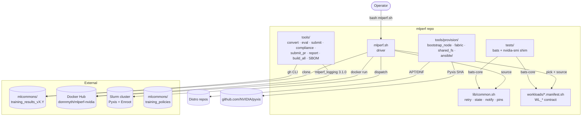
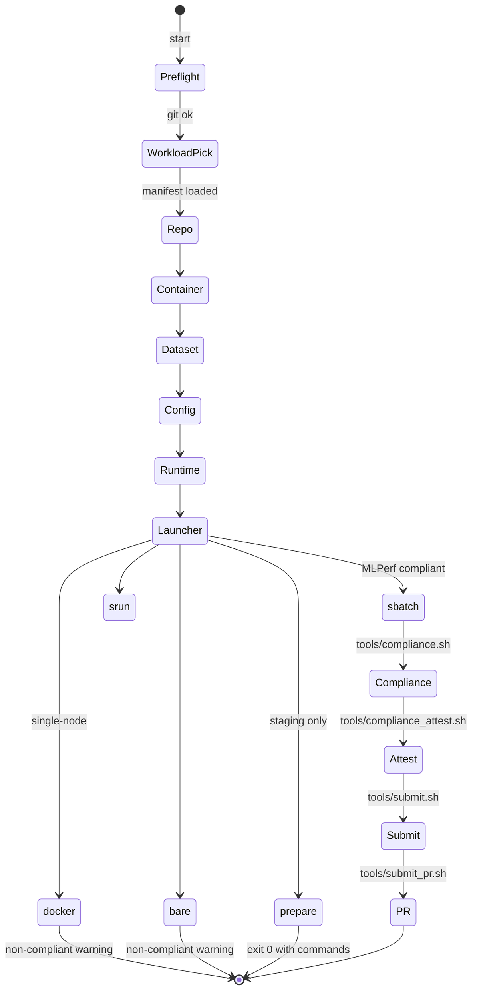

# Architecture

## Component diagram

## Phase state machine

## Key design invariants

1. **Manifest-driven** — the driver has no workload-specific code. Adding a workload means adding a manifest.
2. **Interactive by default, scripted by exception** — `MLPERF_AUTO_YES=1` or `MLPERF_CONFIG_FILE=...` flips every prompt to its default without changing the interactive behaviour.
3. **No GitHub Actions** — every check runs locally or via a user-chosen CI (Jenkins, buildkite). `.git-hooks/pre-commit` for gitleaks; `tests/` for bats; `tools/sbom_and_sign.sh` for cosign.
4. **Pinned upstream** — `lib/common.sh` exports `PIN_*` constants (mlperf_logging version, Pyxis SHA, Enroot version). Changing a pin is a single-file commit.
5. **MLPerf compliance is gated, not promised** — any launcher other than `sbatch run.sub` prints a "not MLPerf-compliant" notice; `tools/compliance.sh` and `tools/compliance_attest.sh` mechanically validate submission artefacts.
